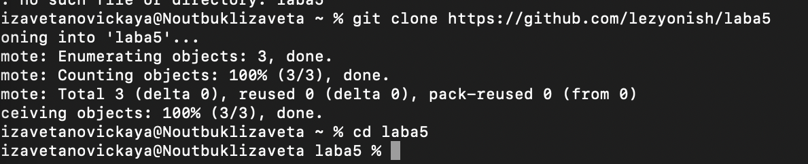
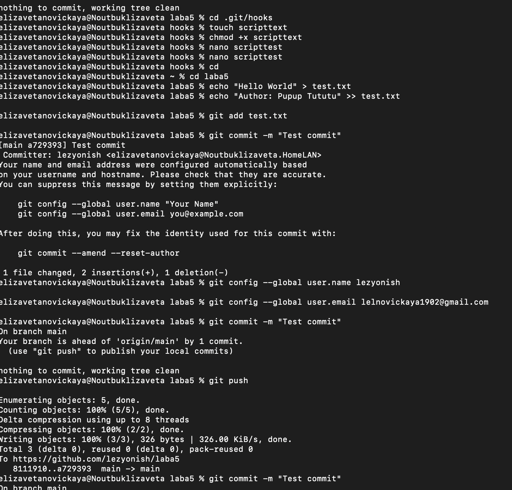
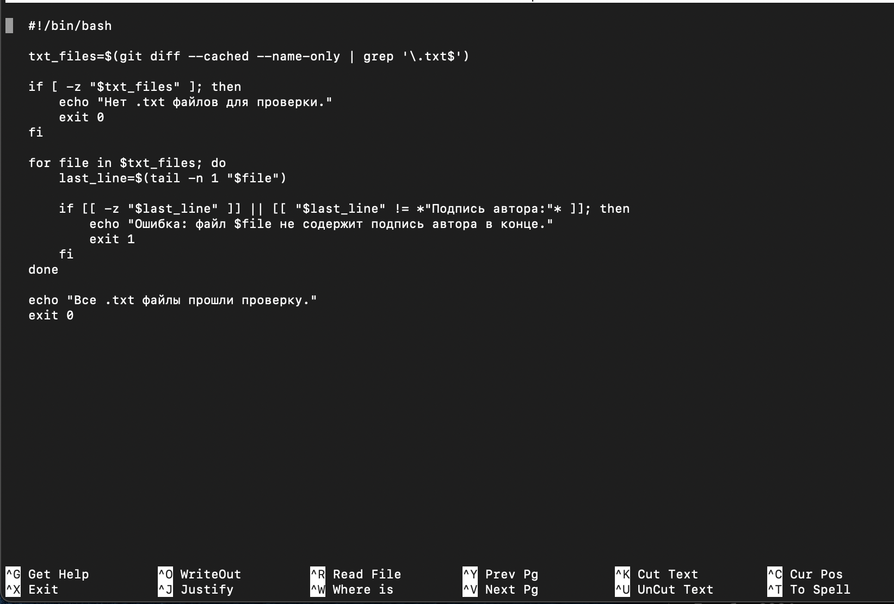
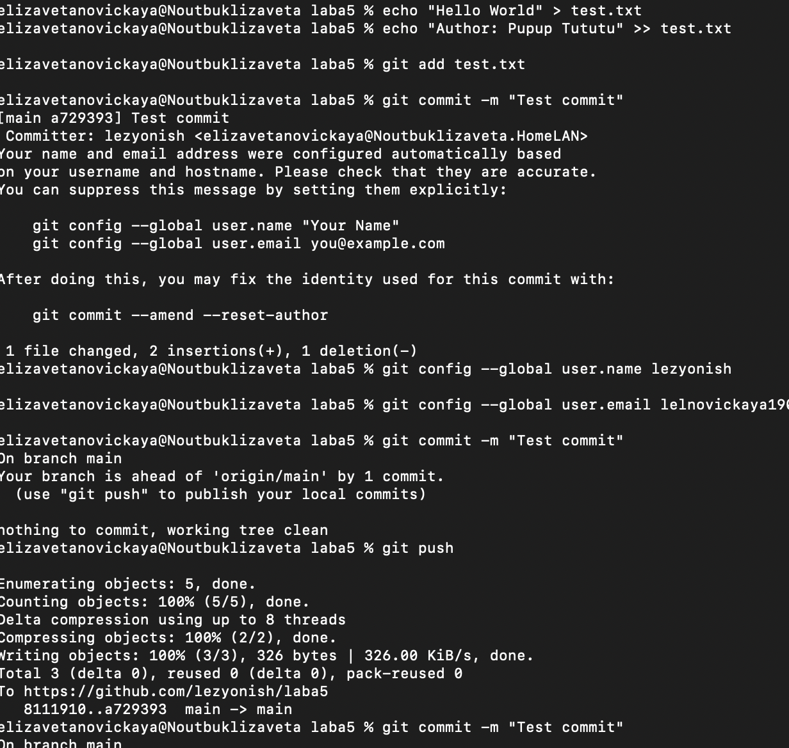
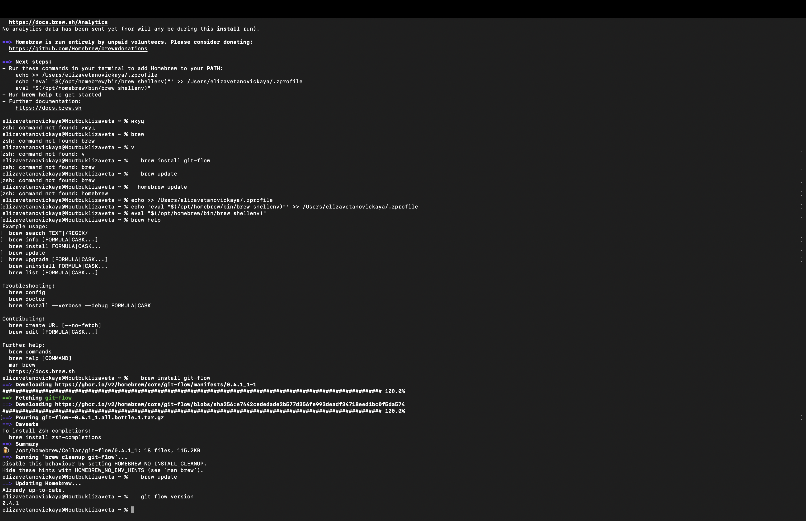
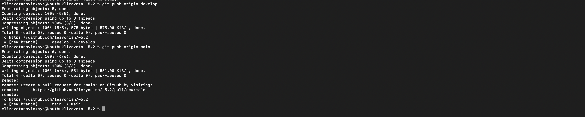
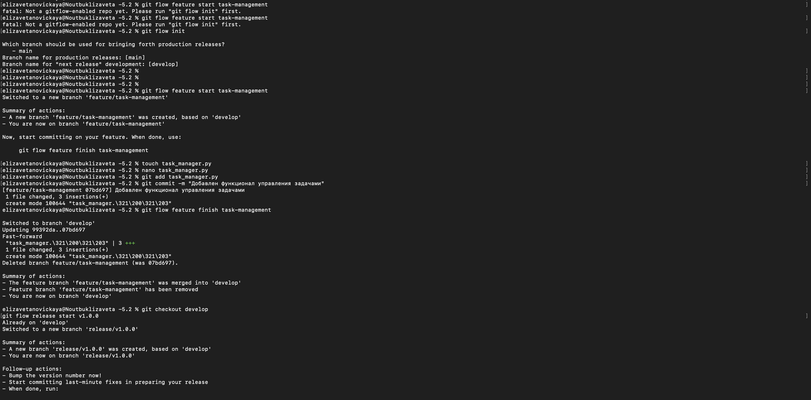
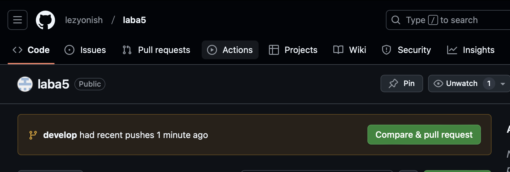
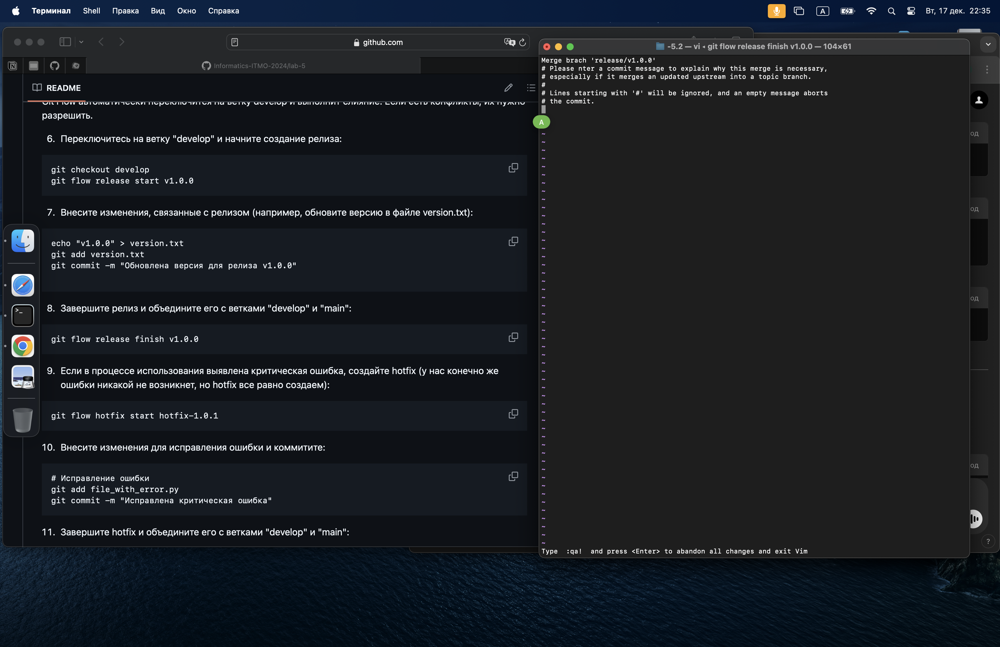
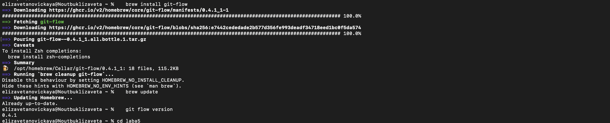

# Новицкая Елизавета К3162 Лабораторная №5

1) Я клонировала репозиторий и открыла рабочую папку


   
   

3) Далее я нашла hooks с помощью
   ```cd .git/hooks```
5) Создала там файл scripttest, наделила его правами и отредактировала
   

   
   
   
6) Прописала в нем следущее:
   

   


В этом скрипте я проверю, что:
В коммит добавляются файлы с расширением .txt.
Каждый из этих файлов содержит строку, которая заканчивается на "Подпись автора:".


7) Далее я создала тестовый файл, сделала коммит


   


8) Затем я перешла к заданию 2
9) Мне потребовалось установить homebrew, так как с его помощью получилось бы скачать git flow

    

10) Далее следовала четко по инструкциям, вот скриншоты промежутков работы:

    

    

    

    

    
